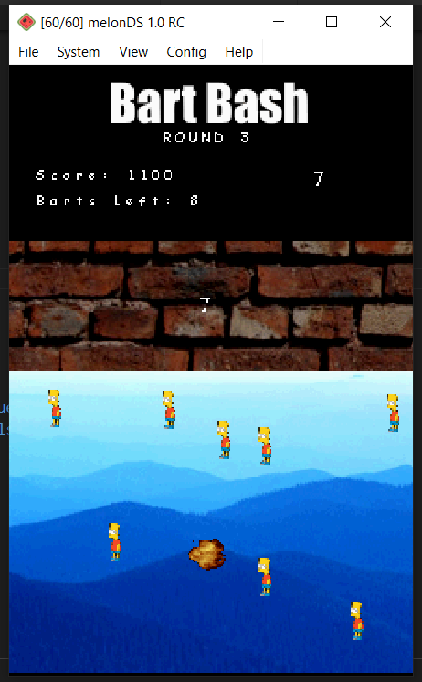
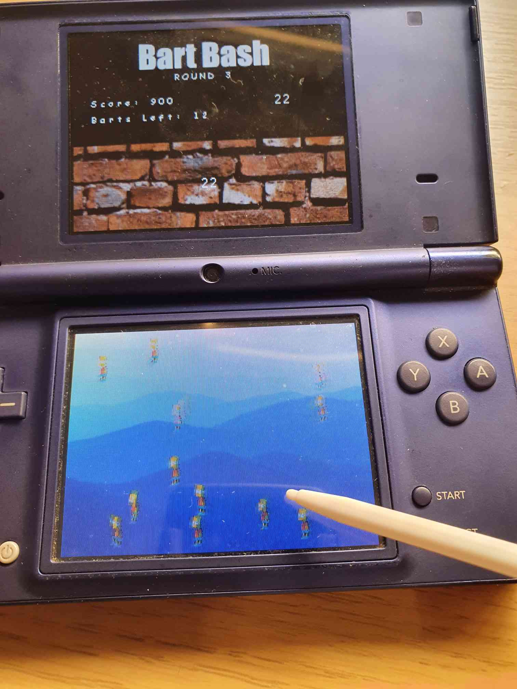

# Bart Bash!
A port of Bart Bash from Uncanny Cat Golf to the NDS via nflib.

## Uncanny Cat Golf
Play it it's so peak
https://slappyhappy2000.itch.io/uncanny-cat-golf

## How to Build???
Make sure you have [BlocksDS](https://blocksds.skylyrac.net/docs/) installed with [nflib](https://github.com/knightfox75/nds_nflib) installed via wf-pacman. Then install [ArchitectDS](https://github.com/AntonioND/architectds), the build system for this project, and simply run `python3 build.py` in the root of the project to produce the .nds file.

## Imgs

